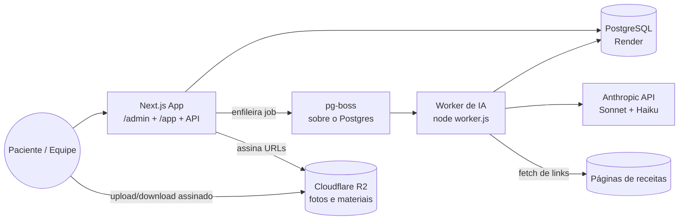

# PRD — App de Nutrição Personalizada

> **Stack:** Next.js (App Router) · TypeScript · Tailwind CSS v4 · PostgreSQL (Render) · Prisma 7 · Auth.js v5 · pg-boss · Anthropic Claude (Sonnet + Haiku) · Cloudflare R2 · Vitest · Zod v4.
> **Idioma do código:** Inglês. **Idioma da interface:** Português brasileiro. **Timezone:** `America/Sao_Paulo`.
> **Documentos relacionados:** requisitos originais em [`PROJECT_BRIEF.md`](../PROJECT_BRIEF.md) · arquitetura detalhada em [`docs/superpowers/specs/2026-07-03-nutrition-app-design.md`](superpowers/specs/2026-07-03-nutrition-app-design.md) · planos por fase em `docs/superpowers/plans/`.
> Este PRD é o documento de requisitos canônico. Em divergência entre documentos, vale o PRD; em detalhe de arquitetura não coberto aqui, vale o design doc.

---

## 1. Visão Geral

O **App de Nutrição Personalizada** é uma plataforma web para uma consultoria de nutrição (< 50 pacientes) que substitui a colcha de retalhos atual (ferramenta de plano alimentar + ferramenta de feedback + Drive) por um único sistema com dois ambientes: **painel da equipe** (`/admin`) e **app do paciente** (`/app`).

O diferencial é uma **camada de IA que trabalha sobre a estrutura nutricional definida pela equipe** — sugerindo receitas do banco, gerando receitas novas e avaliando receitas trazidas pelo paciente — **sem nunca estourar as metas de calorias e macros de cada refeição**. A IA seleciona, ranqueia e mapeia; **a matemática nutricional é sempre do sistema**, calculada a partir de um banco de ingredientes verificado (tabela TACO).

O sistema é **single-tenant** (uma consultoria) por decisão explícita, mas segue regras de projeto que não bloqueiam uma eventual evolução multi-tenant (seção 12).

---

## 2. Objetivos do Produto

1. Centralizar plano alimentar, diário, avaliações físicas e materiais de apoio em um único app.
2. Resolver a dor nº 1 dos pacientes — falta de variedade — com sugestões de IA que respeitam rigorosamente as metas nutricionais por refeição.
3. Permitir que o paciente valide receitas encontradas na internet ("cabe na minha dieta?") em minutos, sem depender da agenda da nutricionista.
4. Adaptar o restante do dia dinamicamente: cada registro de refeição recalcula o saldo de kcal/macros, e as próximas sugestões consideram esse saldo.
5. Garantir precisão nutricional verificável: nenhum valor de macro inventado por LLM.
6. Crescer o banco de receitas com qualidade controlada via fila de curadoria.
7. Manter custo de IA previsível (limites por paciente, cache, modelos por tarefa, auditoria de custo).
8. Dar à equipe visão gerencial da carteira: dashboard com métricas de aderência, evolução e uso de IA.
9. Proteger dados e fotos dos pacientes: acesso estritamente autenticado e segregado por papel.

---

## 3. Público-Alvo e Personas

| Perfil | Descrição | Acesso |
|---|---|---|
| **Equipe (ADMIN)** | Nutricionista e colaboradores. Sem hierarquia interna no MVP. | Painel `/admin` completo: pacientes, planos, receitas, ingredientes, curadoria, avaliações, materiais, dashboard, consumo de IA. |
| **Paciente (PATIENT)** | Cliente da consultoria, cadastrado pela equipe. | App `/app`: apenas os próprios dados — plano, refeições do dia, diário, progresso, materiais. |

- Todo usuário tem exatamente um papel (`ADMIN` ou `PATIENT`).
- Pacientes **não** se auto-cadastram: a equipe cria o login com senha provisória (troca obrigatória no primeiro acesso).
- Não há landing page pública nem planos comerciais: o app atende só a base atual de pacientes.

---

## 4. Problemas que o Sistema Resolve

- Pacientes enjoam das opções fixas do plano e abandonam a dieta por falta de variedade.
- A nutricionista não consegue cadastrar manualmente o universo de receitas que os pacientes trazem da internet.
- "Essa receita cabe na minha dieta?" hoje vira mensagem avulsa que depende da disponibilidade da equipe.
- Quando o paciente foge do plano em uma refeição, o resto do dia fica sem orientação.
- Avaliações físicas, fotos de progresso e materiais espalhados em ferramentas distintas.
- Nenhuma visão consolidada da evolução e da aderência de cada paciente.

---

## 5. Escopo do Produto (MVP)

- Autenticação por email/senha com papéis (equipe, paciente) e troca de senha obrigatória no primeiro login.
- Gestão de pacientes com perfil e limite diário de IA configurável.
- Banco de **ingredientes verificados** importado da tabela TACO (~597 alimentos), extensível (TBCA, cadastro manual).
- Banco de **receitas** com ingredientes referenciados, macros somados pelo sistema e fila de curadoria.
- **Plano alimentar** por paciente: metas diárias + refeições configuráveis com metas próprias de kcal/macros + dieta base prescrita.
- **Sugestões de IA** por refeição: pré-filtro SQL + escala determinística de porção + ranqueamento pelo Claude; 3 opções persistidas; troca sem custo de IA.
- **Geração de receita nova** pela IA quando o banco não tem opção, usando só ingredientes do banco.
- **Avaliação de receita externa**: paciente cola texto ou link; IA extrai e mapeia ingredientes; sistema calcula se cabe (e em que porção).
- **Registro diário** por refeição (plano, sugestão, externa, livre ou pulada) com snapshot imutável de macros e **saldo do dia** recalculado a cada registro.
- **Diário alimentar** com fotos e observações por refeição e por dia.
- **Avaliações físicas** (equipe completa; paciente registra peso) e fotos de progresso.
- **Materiais de apoio** (PDF, imagem, link) globais ou por paciente.
- **Linha do tempo de evolução** consolidando avaliações, fotos e aderência.
- **Dashboard analítico** no admin (seção 18).
- Processamento assíncrono de IA via fila (pg-boss) + worker, com estados visíveis na UI e retry.
- Controle de custo de IA: limite diário por paciente, prompt caching, log de tokens/custo por chamada.

## 6. Fora de Escopo (MVP)

- Multi-tenancy (ver seção 12 — preparado, não implementado).
- Chat/mensageria dedicada (observações do diário são o canal informal).
- Hierarquia de permissões dentro da equipe.
- Auto-cadastro, landing page, planos pagos, qualquer público externo.
- Reset de senha por email (a equipe redefine pelo painel).
- Notificações internas (toast/badge de conclusão de jobs) — a UI usa polling leve do status do job.
- Relatórios exportáveis PDF/CSV.
- Aplicativo mobile nativo (o app do paciente é web mobile-first).
- Testes E2E (o núcleo determinístico tem cobertura unitária completa via TDD).

---

## 7. Visão Funcional do Sistema

1. **Identidade:** login por email, papéis, senha provisória, gestão de usuários pela equipe.
2. **Fundação nutricional:** ingredientes verificados → receitas com macros somados → curadoria.
3. **Prescrição:** plano alimentar com metas por refeição + dieta base.
4. **Dia a dia do paciente:** registro por refeição → saldo do dia → sugestões adaptadas.
5. **Inteligência:** sugestão, geração e avaliação de receitas com governança de custo.
6. **Acompanhamento:** avaliações, fotos, diário, materiais, linha do tempo.
7. **Gestão:** dashboard analítico e auditoria de uso de IA.
8. **Operação:** fila + worker, jobs auditáveis, requisitos agnósticos de host.

---

## 8. Requisitos Funcionais

### 8.1 Autenticação e Usuários

- **RF-01:** Login por **email e senha** (Auth.js v5, provider de credenciais, sessão JWT).
- **RF-02:** Todo usuário tem papel `ADMIN` ou `PATIENT`; a sessão carrega `id`, `role` e `mustChangePassword`.
- **RF-03:** Middleware bloqueia `/admin` para não-ADMIN e `/app` para não-PATIENT.
- **RF-04:** Equipe cadastra pacientes com senha provisória; o primeiro login força troca de senha.
- **RF-05:** Equipe pode redefinir a senha de qualquer paciente pelo painel.
- **RF-06:** Usuários podem ser desativados (login recusado) sem perder histórico.

### 8.2 Pacientes

- **RF-10:** Cadastro de paciente com dados básicos (nome, email, nascimento, sexo) e notas internas da equipe.
- **RF-11:** Cada paciente tem `dailyAiLimit` (padrão 10 operações caras/dia) editável pela equipe.
- **RF-12:** Perfil do paciente no admin com abas: plano alimentar, avaliações, diário, materiais, evolução.

### 8.3 Ingredientes (fundação verificada)

- **RF-20:** Banco de ingredientes com macros por 100 g (kcal, proteína, carboidrato, gordura, fibra) e fonte (`TACO | TBCA | CUSTOM`).
- **RF-21:** Importação da tabela TACO idempotente (upsert por fonte + chave de origem), com valores conferíveis contra a tabela oficial.
- **RF-22:** Cadastro manual de ingredientes pela equipe (fonte `CUSTOM`).
- **RF-23:** Busca por nome para uso em receitas e dieta base.
- **RF-24:** Medidas caseiras opcionais por ingrediente ("1 colher de sopa = 15 g").

### 8.4 Receitas

- **RF-30:** Receita = nome, modo de preparo, rendimento, tipos de refeição adequados e **lista de ingredientes do banco com quantidades em gramas**.
- **RF-31:** Macros da receita são **sempre a soma dos ingredientes**, calculada pelo sistema e denormalizada por porção; recalculada a cada edição. Nenhum campo de macro é editável diretamente nem preenchível por LLM.
- **RF-32:** Status: `APPROVED` (banco geral), `PENDING_REVIEW` (fila de curadoria), `PRIVATE` (só do paciente de origem).
- **RF-33:** Origem: `TEAM`, `AI_GENERATED`, `EXTERNAL`.
- **RF-34:** Fila de curadoria no admin: aprovar (vira `APPROVED`, entra no banco geral), editar ou rejeitar receitas `PENDING_REVIEW`.
- **RF-35:** Receita gerada/aprovada pela IA vale imediatamente para o paciente de origem, antes da curadoria.

### 8.5 Plano Alimentar

- **RF-40:** Um plano ativo por paciente com metas diárias totais (kcal + macros).
- **RF-41:** Refeições configuráveis por paciente (`MealSlot`): nome, ordem, horário aproximado, tipo (café, almoço, lanche, jantar, ceia) e **metas próprias de kcal/macros** — a unidade que a IA respeita.
- **RF-42:** Dieta base por refeição: itens prescritos pela equipe (ingrediente + gramas ou receita + porções).
- **RF-43:** Paciente visualiza a dieta base completa no app.

### 8.6 Sugestões de IA por Refeição

- **RF-50:** Pipeline: (1) SQL pré-filtra receitas `APPROVED` por tipo de refeição e viabilidade de escala (fator 0.5x–2x); (2) o **sistema** calcula o fator de porção e valida tolerâncias (±5% kcal, ±10% por macro); (3) o Claude ranqueia as candidatas válidas e escolhe 3 por variedade, considerando o que o paciente já comeu no dia e sugestões recentes.
- **RF-51:** Sugestões persistidas (`MealSuggestion` com fator de porção e snapshot de macros); alternar entre elas **não** chama IA.
- **RF-52:** O saldo atualizado do dia entra no contexto das sugestões das refeições seguintes.

### 8.7 Geração de Receita Nova

- **RF-60:** Quando o banco não tem opção adequada, o Claude monta receita usando **apenas IDs de ingredientes do banco** + quantidades em gramas.
- **RF-61:** O sistema soma os macros; fora da tolerância, tenta escala determinística e depois devolve o erro ao Claude para ajuste (máx. 2 tentativas; falha é comunicada ao paciente).
- **RF-62:** Receita validada é salva como `PRIVATE`/`PENDING_REVIEW` (RF-35).

### 8.8 Avaliação de Receita Externa

- **RF-70:** Paciente cola **texto ou link** de receita; para link, o worker baixa a página e extrai o texto.
- **RF-71:** Claude extrai ingredientes + quantidades e mapeia cada um para o ingrediente mais próximo do banco, marcando os sem correspondência confiável.
- **RF-72:** Sistema soma macros e calcula o ajuste de porção para a refeição alvo.
- **RF-73:** Veredito em três estados: *cabe como está* / *cabe comendo X% da receita* / *não cabe, com o motivo*.
- **RF-74:** Ingredientes não mapeados geram ressalva visível ("estimado sem o ingrediente Y") e entram numa lista para a equipe cadastrar.
- **RF-75:** Receita externa usada pelo paciente vira `PRIVATE`/`PENDING_REVIEW`.

### 8.9 Registro Diário e Saldo

- **RF-80:** Um registro por refeição por dia, com status `COMPLETED` ou `SKIPPED` e tipo: opção do plano, sugestão de IA, receita externa aprovada ou **registro livre** (descrição + kcal/macros estimados).
- **RF-81:** O registro **congela um snapshot** dos macros consumidos — edições futuras de receitas não alteram o histórico.
- **RF-82:** O **saldo do dia** (metas do plano − consumido) é calculado por serviço a cada leitura; não é estado armazenado.
- **RF-83:** Registro pode ser editado/desfeito no mesmo dia pelo paciente.

### 8.10 Diário Alimentar

- **RF-90:** Fotos por refeição (upload direto ao R2 via URL pré-assinada).
- **RF-91:** Observações do paciente por refeição e por dia — também canal informal de feedback para a equipe.
- **RF-92:** Equipe visualiza o diário de cada paciente no admin (leitura).

### 8.11 Avaliações Físicas e Progresso

- **RF-100:** Equipe registra avaliação completa: peso, altura, circunferências, % gordura, massa muscular, notas.
- **RF-101:** Paciente registra **peso** e **fotos de progresso** entre consultas.
- **RF-102:** Linha do tempo consolida avaliações, fotos e aderência ao plano (derivada dos registros diários) — sem tabela própria, é uma consulta.

### 8.12 Materiais de Apoio

- **RF-110:** Equipe faz upload de PDF/imagem ou cadastra link, atribuído a um paciente específico ou a todos.
- **RF-111:** Paciente acessa apenas os materiais globais e os atribuídos a ele.

### 8.13 Dashboard Analítico (admin)

- **RF-120:** Visão geral da carteira: pacientes ativos, avaliações recentes, pendências de curadoria.
- **RF-121:** Métricas de aderência: % de refeições registradas vs. planejadas, por paciente e agregada, com janela de tempo selecionável.
- **RF-122:** Evolução agregada: variação de peso da carteira, pacientes sem registro há N dias (alerta de abandono).
- **RF-123:** Uso de IA: operações por tipo, tokens e custo estimado por período e por paciente.
- **RF-124:** Gráficos servidos como dados (JSON) por route handlers e renderizados no cliente; consultas agregadas no banco, nunca em memória sobre listas inteiras.

### 8.14 Governança de IA e Custo

- **RF-130:** Toda chamada de IA é um job auditável (`AiJob`): tipo, paciente, input, resultado, tokens, custo estimado, status.
- **RF-131:** Operações caras (gerar receita, avaliar externa) contam no `dailyAiLimit` do paciente; atingido o limite, a UI informa com clareza.
- **RF-132:** Prompt caching da Anthropic nos blocos estáveis (system prompt, lista de ingredientes).
- **RF-133:** Modelos por tarefa: Haiku para extração/mapeamento; Sonnet para ranqueamento/geração. Configuração centralizada num único ponto.
- **RF-134:** Saída do LLM sempre em JSON estruturado (tool use) contendo só referências a ingredientes e quantidades — **nunca valores nutricionais**.

---

## 9. Requisitos Não Funcionais

### 9.1 UX e Responsividade

- **RNF-01:** App do paciente **mobile-first** (uso diário no celular); painel admin desktop-first, funcional em tablet.
- **RNF-02:** Toda ação que dispara IA mostra estado "processando" imediato e resultado via polling leve; falha definitiva mostra erro claro com botão de tentar de novo. Nenhuma request HTTP fica presa esperando o LLM.
- **RNF-03:** Interface inteira em português brasileiro; contraste e legibilidade adequados (paleta emerald sobre zinc).

### 9.2 Segurança

- **RNF-10:** Paciente só acessa os próprios dados — toda query de dados de paciente filtra por `patientId` da sessão, nunca de parâmetro do cliente.
- **RNF-11:** Bucket R2 privado; upload e leitura só por URLs assinadas de curta duração; chaves com namespace `patients/{id}/...`; acesso a arquivo de outro paciente retorna 404.
- **RNF-12:** Validação com Zod v4 em toda fronteira de API (route handlers e server actions).
- **RNF-13:** Segredos só em variáveis de ambiente (`.env` gitignored); nunca em código, log ou commit. Senhas com bcrypt; hashes nunca logados.
- **RNF-14:** O agente de IA recebe `patientId` do usuário autenticado — nunca do input livre; prompts não incluem dados de outros pacientes.

### 9.3 Precisão Nutricional

- **RNF-20:** Nenhum valor nutricional no sistema tem origem em estimativa de LLM; a única fonte são ingredientes verificados e aritmética do sistema.
- **RNF-21:** O núcleo determinístico (soma nutricional, fator de porção, saldo, tolerâncias, orçamento de IA) tem cobertura unitária completa, desenvolvida com TDD.
- **RNF-22:** Registros históricos são imutáveis (snapshots) — relatórios e evolução nunca mudam retroativamente.

### 9.4 Performance

- **RNF-30:** Processamento de IA e scraping de links sempre no worker via fila — nunca no ciclo request/response.
- **RNF-31:** Consultas de listagem paginadas; agregações do dashboard feitas no banco.
- **RNF-32:** Sugestões persistidas são reutilizadas; trocar de opção não gera chamada de IA.

### 9.5 Operação (agnóstica de host)

A hospedagem do app será decidida antes do primeiro deploy; nada no código pode depender de recursos proprietários de plataforma. Requisitos que qualquer host escolhido deve atender:

- **RNF-40:** Dois processos: web (Next.js) e worker (Node puro consumindo pg-boss). O worker roda com `node`, sem dependência do runtime do host.
- **RNF-41:** Rota `/api/health` pública e leve (200 sem tocar em banco) para health checks.
- **RNF-42:** Backup diário automatizado do PostgreSQL com retenção mínima de 7 dias (nativo do Render ou script agendado).
- **RNF-43:** Jobs de IA com retry automático e backoff (pg-boss); falha definitiva fica registrada e visível, nunca silenciosa.
- **RNF-44:** Variáveis de ambiente idênticas em forma entre dev e produção (mesmo `.env.example`); produção com valores próprios e `AUTH_SECRET` distinto.
- **RNF-45:** Logs dos jobs de IA incluem id, tipo, duração, tokens e custo — suficientes para auditar gasto sem ferramenta externa.

---

## 10. Arquitetura Técnica

### 10.1 Stack

| Camada | Tecnologia |
|---|---|
| Framework web | Next.js (App Router) + TypeScript |
| UI | Tailwind CSS v4 (sem lib de componentes no MVP) |
| Banco de dados | PostgreSQL (Render) |
| ORM | Prisma 7 (generator `prisma-client`, driver adapter `@prisma/adapter-pg`) |
| Autenticação | Auth.js v5 (`next-auth@beta`), credenciais + JWT |
| Fila / worker | pg-boss (fila sobre o próprio PostgreSQL) + processo Node |
| IA | API Anthropic — Claude Sonnet (geração/ranqueamento) e Haiku (extração/mapeamento) |
| Storage | Cloudflare R2 (S3-compatível), bucket privado, URLs pré-assinadas |
| Validação | Zod v4 |
| Testes | Vitest (unitário; TDD no núcleo determinístico) |

### 10.2 Diagrama de Componentes

### 10.3 Camadas de Código

- `src/app/` — rotas: `/admin` (equipe), `/app` (paciente), `(auth)` (login/troca de senha), `api/` (route handlers).
- `src/server/services/` — **toda a lógica de negócio** em funções puras/testáveis com dependências injetáveis: cálculo nutricional, fator de porção, saldo diário, orçamento de IA, curadoria.
- `src/server/db.ts` — único ponto de instanciação do Prisma (com adapter).
- `src/server/auth/` — config edge-safe (`config.ts`) + config completa (`index.ts`).
- `src/lib/` — contratos compartilhados: tipos de domínio, schemas Zod.
- `worker/` — processo do worker pg-boss (Fase 4).
- `prisma/` — schema, migrations, seed; `scripts/` — importações e utilitários.

---

## 11. Modelagem de Domínio (resumo)

O schema completo vive em `prisma/schema.prisma` e está detalhado no design doc (seção 4). Entidades por domínio:

| Domínio | Entidades |
|---|---|
| Identidade | `User` (role ADMIN/PATIENT), `PatientProfile` (dailyAiLimit, dados clínicos básicos) |
| Nutrição | `Ingredient` (macros/100 g, fonte), `Recipe` (status, origem, totais por porção denormalizados), `RecipeIngredient` |
| Prescrição | `MealPlan` (metas diárias), `MealSlot` (metas por refeição), `MealSlotItem` (dieta base) |
| Execução | `MealLog` (snapshot imutável, único por paciente+dia+refeição), `MealLogPhoto` |
| IA | `AiJob` (fila + auditoria + contador de limite), `MealSuggestion` (fator de porção + snapshot) |
| Acompanhamento | `Assessment`, `ProgressPhoto`, `DiaryNote`, `Material`, `MaterialAssignment` |

Invariantes:

- Macros de `Recipe` só mudam por recálculo do sistema a partir de `RecipeIngredient`.
- `MealLog` nunca é alterado por mudanças posteriores em receitas/planos.
- `AiJob` é a única porta de entrada para chamadas ao Claude — não existe chamada de IA fora da fila.

---

## 12. Single-Tenant Preparado

O sistema atende **uma** consultoria. Não há entidade tenant, middleware de tenant nem FK de clínica — complexidade recusada de propósito. Porém, para não bloquear uma eventual expansão SaaS, valem as regras:

- **IDs opacos** (cuid) em todas as entidades — nada de sequências previsíveis expostas.
- **Storage com namespace** (`patients/{id}/...`) — um prefixo de tenant pode ser adicionado acima sem migrar arquivos por paciente.
- **Nenhuma configuração de negócio hardcoded**: tolerâncias, limites e modelos de IA vivem em um módulo único de configuração, futuro candidato a tabela de settings.
- **Serviços recebem contexto explícito** (`patientId`, `userId` como parâmetros) — nunca leem estado global; adicionar `clinicId` ao contexto é mudança localizada.
- **Sem singletons de domínio** no código (ex.: "a nutricionista") — a equipe já é N usuários ADMIN.

Se a expansão vier: cria-se `Clinic`, adiciona-se FK nas entidades sensíveis e filtro por tenant na camada de serviços — sem reescrever fluxos de negócio.

---

## 13. Segurança e Isolamento

- **Autenticação:** Auth.js v5, credenciais, JWT. Senhas bcrypt (custo 12). Sessão carrega `id`, `role`, `mustChangePassword`.
- **Autorização em camadas:** middleware (bloqueio por prefixo de rota) + verificação de sessão em layouts + filtro por `patientId` da sessão em toda query de dados de paciente. Route handlers e server actions revalidam a sessão — nunca confiam em IDs vindos do cliente para decidir "de quem" é o dado.
- **Arquivos (R2):** bucket privado; upload direto do navegador com URL pré-assinada de escopo estreito (chave + content-type + tamanho máximo); leitura com URL assinada de curta duração; cross-access retorna 404 (não 403, para não vazar existência).
- **IA:** tools/inputs recebem `patientId` da sessão; o LLM nunca escolhe o paciente. Saída estruturada validada com Zod antes de persistir.
- **Segredos:** `.env` local e de produção separados, ambos gitignored; `AUTH_SECRET` distinto por ambiente; credenciais R2 e Anthropic só no servidor/worker.

---

## 14. Fluxos Principais

### 14.1 Onboarding de Paciente

1. Equipe cadastra paciente no admin (dados + senha provisória).
2. Equipe monta o plano: metas diárias → refeições com metas próprias → dieta base por refeição.
3. Paciente recebe as credenciais fora do app (canal atual da consultoria).
4. Primeiro login → troca de senha obrigatória → cai em `/app` e vê o dia atual.

### 14.2 Dia do Paciente (adaptação dinâmica)

1. Paciente abre "Hoje": refeições do dia + saldo restante de kcal/macros.
2. Em cada refeição escolhe: seguir a dieta base · usar uma sugestão de IA · validar receita externa · registro livre · pular.
3. Cada registro congela o snapshot e recalcula o saldo.
4. Sugestões das próximas refeições recebem o saldo atualizado no contexto.

### 14.3 Sugestão de IA

1. Paciente pede opções para uma refeição → API cria `AiJob` (SUGGEST) e responde na hora.
2. UI mostra "gerando sugestões…" e faz polling do job.
3. Worker: pré-filtro SQL → escala determinística → Claude ranqueia → 3 `MealSuggestion`s persistidas.
4. Paciente alterna entre as opções livremente (sem IA) e registra a escolhida.

### 14.4 Receita Externa

1. Paciente cola texto/link e escolhe a refeição alvo → `AiJob` (EVALUATE_EXTERNAL).
2. Worker: extrai texto (fetch se link) → Claude extrai e mapeia ingredientes → sistema soma e calcula porção.
3. Veredito com ressalvas de ingredientes não mapeados.
4. Se o paciente usa a receita: vira `PRIVATE`/`PENDING_REVIEW` e entra na curadoria.

### 14.5 Curadoria

1. Admin abre a fila (`PENDING_REVIEW`).
2. Revisa nome, ingredientes, quantidades e preparo; ajusta se necessário (macros recalculam sozinhos).
3. Aprova (→ `APPROVED`, disponível para todos) ou rejeita (permanece só no histórico do paciente de origem).

### 14.6 Acompanhamento

1. Consulta presencial → equipe registra avaliação física completa.
2. Entre consultas → paciente registra peso e fotos de progresso.
3. Linha do tempo consolida tudo + aderência derivada dos registros diários.

---

## 15. Dashboard e Métricas (admin)

- **Cartões de visão geral:** pacientes ativos, registros de hoje, receitas pendentes de curadoria, custo de IA no mês.
- **Aderência:** % de refeições registradas vs. planejadas por paciente (semana/mês); ranking de pacientes com baixa aderência; alerta de pacientes sem registro há N dias.
- **Evolução:** gráfico de peso por paciente; visão agregada da carteira.
- **IA:** operações por tipo/dia, tokens e custo estimado, top pacientes por uso.
- **Implementação:** route handlers servem JSON agregado (queries `GROUP BY` no Postgres); gráficos renderizados no cliente; nenhuma agregação pesada em request de página.

---

## 16. Critérios de Aceite (MVP)

- [ ] Paciente não consegue acessar dados (registros, fotos, materiais) de outro paciente por nenhuma rota ou URL.
- [ ] Nenhum valor nutricional no banco tem origem em texto de LLM — auditável pelo schema (campos calculados) e pelos testes.
- [ ] Sugestões da IA sempre caem na tolerância (±5% kcal, ±10% macro) da refeição alvo — verificado por teste do pipeline com Claude mockado.
- [ ] Trocar entre as 3 sugestões persistidas não gera chamada à API da Anthropic.
- [ ] Receita externa recebe veredito em três estados com porção ajustada e ressalvas de ingredientes não mapeados.
- [ ] Registro de refeição congela snapshot; editar a receita depois não muda o histórico.
- [ ] Saldo do dia reflete cada registro imediatamente e influencia as próximas sugestões.
- [ ] Receita gerada pela IA vale na hora para o paciente e só entra no banco geral após aprovação na curadoria.
- [ ] Paciente com `dailyAiLimit` atingido recebe mensagem clara e não gera job.
- [ ] `AiJob` registra tokens e custo de toda chamada; dashboard mostra o agregado.
- [ ] Upload de foto vai direto ao R2 com URL pré-assinada; bucket não tem acesso público; leitura cross-patient retorna 404.
- [ ] Primeiro login de paciente força troca de senha; equipe consegue redefinir senha pelo painel.
- [ ] Falha definitiva de job de IA aparece na UI com opção de tentar de novo.
- [ ] `npm run test` e `npm run build` passam; núcleo determinístico com cobertura unitária completa.
- [ ] Nenhum segredo em código ou histórico do git.

---

## 17. Riscos Técnicos e Mitigações

| Risco | Mitigação |
|---|---|
| LLM inventa valores nutricionais | Saída estruturada só com IDs + gramas; macros sempre somados pelo sistema; validação Zod; testes do contrato. |
| Sugestão estoura a meta da refeição | Escala determinística + validação de tolerância **no sistema**, antes e depois do ranqueamento; o Claude só ordena candidatas já válidas. |
| Mapeamento errado de ingrediente externo | Ressalvas explícitas de baixa confiança; ingredientes não mapeados listados para a equipe; curadoria antes do reuso geral. |
| Custo de IA imprevisível | Limite diário por paciente; prompt caching; sugestões reutilizadas; Haiku nas tarefas mecânicas; custo por job auditado no dashboard. |
| Vazamento entre pacientes | Filtro por `patientId` da sessão em toda query; R2 privado com URLs assinadas; 404 em cross-access; revisão de código com esse checklist. |
| Job de IA travado/perdido | pg-boss com retry + backoff; status visível na UI; jobs falhos permanecem auditáveis. |
| Histórico corrompido por edições | Snapshots imutáveis em `MealLog` e `MealSuggestion`. |
| Fila no Postgres vira gargalo | Volume esperado é ínfimo (<50 pacientes); se crescer, migração localizada para BullMQ/Redis (decisão registrada no design doc). |
| Dependência de página externa (link de receita) | Fetch no worker com timeout; falha vira erro claro com sugestão de colar o texto direto. |
| Lock-in de host antes da decisão | RNF-40..45: nada proprietário de plataforma; worker é Node puro; health check e env padronizados. |

---

## 18. Fases de Desenvolvimento

Cada fase termina utilizável. Planos detalhados (com tarefas TDD passo a passo e divisão Claude/Codex) vivem em `docs/superpowers/plans/`.

### Fase 1 — Fundação *(em execução)*

- [x] Scaffold Next.js + Tailwind v4 + Vitest; contratos compartilhados (tipos + Zod).
- [ ] Schema Prisma completo + migração inicial (Prisma 7).
- [ ] Seed do admin; importação TACO idempotente.
- [ ] Auth.js v5: login, roles, middleware, troca de senha obrigatória.
- [ ] Telas de login/troca de senha; shells `/admin` e `/app`.

### Fase 2 — Admin Core

- [ ] CRUD de ingredientes (busca, cadastro manual).
- [ ] CRUD de receitas com composição por ingredientes e recálculo automático de macros.
- [ ] Gestão de pacientes (cadastro, perfil, reset de senha, `dailyAiLimit`).
- [ ] Editor de plano alimentar: metas diárias, refeições configuráveis, dieta base.

### Fase 3 — App do Paciente

- [ ] "Hoje": refeições do dia + saldo de kcal/macros (serviço de saldo com TDD).
- [ ] Registro por refeição (plano, livre, pulada) com snapshot imutável.
- [ ] Fotos (R2 com URLs pré-assinadas) e observações por refeição/dia.
- [ ] Visualização da dieta base; diário histórico.

### Fase 4 — Camada de IA

- [ ] Worker + fila pg-boss; `AiJob` como porta única de IA.
- [ ] Fluxo de sugestões (pré-filtro SQL, escala determinística, ranqueamento, persistência).
- [ ] Geração de receita nova com loop de validação.
- [ ] Avaliação de receita externa (texto e link) com vereditos e ressalvas.
- [ ] Curadoria no admin; limites de custo, prompt caching, modelos por tarefa.
- [ ] UI assíncrona: estados de processamento, polling, erro com retry.

### Fase 5 — Acompanhamento e Gestão

- [ ] Avaliações físicas (equipe) + peso e fotos de progresso (paciente).
- [ ] Materiais de apoio (globais e por paciente).
- [ ] Linha do tempo de evolução.
- [ ] Dashboard analítico (aderência, evolução, uso/custo de IA, alertas de abandono).

---

## 19. Checklist Final de Qualidade

- [ ] Código em inglês; UI em português brasileiro; timezone `America/Sao_Paulo`.
- [ ] Contratos compartilhados em `src/lib/`; lógica de negócio em `src/server/services/` com dependências injetáveis.
- [ ] `PrismaClient` instanciado apenas em `src/server/db.ts` (Prisma 7 + adapter).
- [ ] `src/server/auth/config.ts` permanece edge-safe (sem Prisma/bcrypt).
- [ ] TDD no núcleo determinístico; pipeline de IA testado com Claude mockado; `npm run test` e `npm run build` verdes em todo commit de conclusão de tarefa.
- [ ] Toda chamada de IA passa por `AiJob` na fila; nenhuma chamada síncrona no request.
- [ ] Saída de LLM validada com Zod; sem valores nutricionais vindos do modelo.
- [ ] Snapshots imutáveis em registros históricos.
- [ ] Queries de paciente filtradas pela sessão; R2 privado; 404 em cross-access.
- [ ] Limite diário de IA aplicado; tokens/custo logados por job.
- [ ] Regras de "single-tenant preparado" respeitadas (seção 12).
- [ ] Nenhum recurso proprietário de host; worker roda com `node` puro; `/api/health` leve.
- [ ] Segredos fora do git; `.env.example` atualizado a cada nova variável.
- [ ] App do paciente mobile-first; ações de IA com feedback assíncrono (processando/erro/retry).
- [ ] Divisão de trabalho respeitada: tarefas `[CODEX]` autocontidas com critérios de aceite; revisão do Claude antes de integrar.
